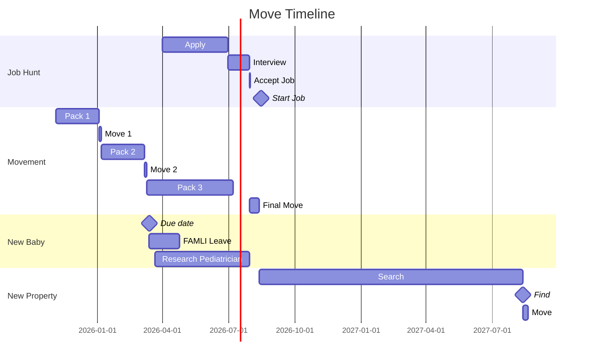

# Planning Phase
## Plan 1 - Move to temp location
### Summary
Moving to a temporary location provides the opportunity to live in an area 
before making the final decision. It also provides the ability to spend more
time exploring and seeing the benefits or downsides to areas of interest. 
#### Advantages :thumbsup:
 * Try before you buy
 * More time for explortation
 * Ability to make more informed decision
#### Disadvantages :poop: 
 * Delays overall timeline
 * Requires multiple moves
 * Complicates Lucas' job search
## Plan 2 - Move direct
### Summary
This plan assumes that Lucas' job search is higher priority. Moving directly to
a new location expidites the timeline. It entails making a decision prior to 
leaving Colorado on the (at least) area where you want to live. It does not 
necessarily entail property is purchased, but would entail that a decision is 
made on the area you will live/work.
#### Advantages :thumbsup:
 * Shorter timeline
 * Less risk to job search aspect
 * Multiple moves (if necessary) will be shorter distance
#### Disadvantages :poop:
 * Does not allow try-before-you-buy
 * May still imply multiple moves (e.g. rent, then buy)
## How to execute possible plans - TODO
## Constraints and Limitations - TODO Improve this and break down by plan
 * Job location
 * Job search may cause timeline to slip
 * Selling Colorado house may
 * New baby may cause timeline to slip
 * No hard time/decision point for final decisions
    - Selection of the area
    - Move date from CO -> AR

# Possible Locations
## Fayetteville :boar: :pig_nose:
### Summary
Fayetteville is in vibrant NW AR which offers many amenities that are not 
found elsewhere in the state. Lots of money has gone into this area and there 
seems to be a more health-conscious population. It is further from most family 
and friends, but offers many opportunities that are harder to find in other 
parts of the state.
### Advantages :thumbsup:
 * Young population
 * Growing area
 * Close to many fun NW AR things
 * Close to (possibly) best hospitals and schools
 * Clean grocery store options
 * Close to Ozarks (outdoor activities)
 * Close to job opportunities
### Disadvantages :poop:
 * Further from family
 * Further from friends
 * More expensive (probably)
 * Rockier soil (probably)
 * Harder (probably) to find uncontaminated land (chicken/pig farms)
## Conway :bear:
### Summary
Conway is an up-and-coming city with a young population. It is close to LR and 
New Blaine which adds to its appeal. It is not part of the LR metro which brings
certain pros and cons. It gives a slightly more rural character, but requires
travel to LR for certain amenities.
### Advantages :thumbsup: 
 * Young population
 * Growing area
 * Close to family
 * Close to friends
 * Close to LR job opportunities
 * Close to good healthcare and schools
 * Close to Ouachitas and Ozarks (maybe)
 * Soil is more available (probably)
 * Easier to find uncontaminated land (probably)
 * Medium expensive (probably)
 * Faulkner county has low chicken, pig, and pesticide use (compared to others)
### Disadvantages :poop:
 * Further from fun NW AR stuff
 * Fewer clean grocery store options (probably)
 * Relies on proximity to LR for some of its advantages listed above
## Fort Smith :question:
### Summary
Fort Smith is a blue collar town and thus cheaper. The air force base is growing
and there will likely be potential for jobs. The many factories in the town also
provide job opportunity. Its primary benefit its central location between NW AR
and New Blaine, and its river valley location.
### Advantages :thumbsup:
 * Cheaper
 * Proximity to family
 * Closer to (some) friends
 * One hour to Fayetteville or New Blaine
 * Decent healthcare (maybe) and schools
 * Some museums (history type)
### Disadvantages :poop:
 * Fewer job opportunities for Lucas (possibly)
 * Must travel 1hr or more for anything bigger
## Cabot :strawberry:
### Summary
Northeast of LR (30min). Smaller, more rural city close to LR. It is more delta 
ecologically making the soil very good (likely). It very near to Jacksonville
which provides job opportunities to Lucas. Relies heavily on proximity to LR for
amenities. Apparently known for its strawberry festival and Cabotfest.
### Advantages :thumbsup:
 * Possibly best soil offering
 * Probably few chicken/pig farms
 * Small town, near to LR
 * Close to many defense type jobs
 * Near (45min) to Conway friends
 * Good duck hunting if you have water 
### Disadvantages :poop:
 * Possibly more pesticide concerns (uncertain)
 * Further from New Blaine
 * Further from most outdoor activities (not Ozark, Ouachita, or lakes)
## Benton :leopard:
### Summary
Southwest of LR (30min). Smaller, more rural but growing part of LR metro. Near
to Hot Springs and LR, it is close to different types of amenities and
entertainment. Very near to Bryant which has many amenities and (allegedly) is a
homeschooling center. Near to family and 45min to Conway friends.
### Advantages :thumbsup:
 * Close to LR but still mostly rural
 * Close to fun shops in Bryant
 * Bryant allegedly is big on homeschool stuff
 * Close to Jonathan and Wendy
 * Near (45min) to Conway friends
 * Close to Hot Springs entertainment
 * Possibly lowest contaminant concentration
### Disadvantages :poop:
 * Further from New Blaine and most family
## Hot Springs :racehorse:
### Summary
Southwest of LR and in the Ouachitas, it offers many entertainment and outdoor
activities. Land appears to be relatively cheap but may be difficult to find
suitable soil due to its ecology. It is slightly further from most family and
friends.
### Advantages :thumbsup:
 * Lots of entertainment
 * Lots of fun restaurants (probably)
 * Close to various outdoor activities (lakes, Ouachitas)
 * Close to Benton family
 * Good fishing
 * Low pesticide use, low contamination (compared to others)
### Disadvantages :poop:
 * Far from NW AR
 * Further (1hr) to LR
 * Further (1:15) to friends in Conway
 * Further from most family
## Russellville :cyclone:
### Summary
Center of the river valley, many different ecologies available. Center of Ozarks
and Ouachitas, it is near to many outdoor-type activites. Very rural character.
Near to New Blaine and Conway making it near, if not close, to family and
friends.
### Advantages :thumbsup:
 * Proximity to many different outdoor activities
 * Cheaper
 * Proximity to New Blaine and Conway
 * Central between LR and NW AR
 * Good fishing and deer hunting
 * Close to Ouachitas, Ozarks, Petit Jean, Nebo, Lake Dardanelle
### Disadvantages :poop:
 * Healthcare and schools are lower quality
 * Further from NW AR and LR
 * Few if any healthy grocery store options
## Perryville, Bigelow, Roland :deciduous_tree:
### Summary
Close to Conway and LR, this is where river valley meets the Ouachitas. Very
rural, mostly farming communities. Good soil further east, more secluded further
west. Proximity to Ouachitas gives it good proximity to outdoor activities.
### Advantages :thumbsup:
 * Close to Ouachitas, lakes, rivers
 * Close to Conway - Bigelow (25min), Perryville (35min), Roland (45min)
 * Close to LR - Roland (30min), then Bigelow, then Perryville (1hr)
 * Near to New Blaine - Perryville (1:05), Bigelow (1:15), Roland (1:40)
 * Good soil
 * Apparently a homesteading conference is here (small)
 * Good fishing, deer, and duck hunting
 * Medium to low pesticide and contamination (probably)
### Disadvantages :poop:
 * More secluded
 * Very little in the towns
 * Flood plain (good for soil, but must be considered for farm)
 * Further from healthcare and schools
## New Blaine :rowboat: :tractor:
### Summary
New Blaine is where the Fulmer clan has become headquartered. There are multiple
properties in the area which are already owned and may be immediately used. It 
is relatively near to Conway and Fort Smith, though it's closest city with 
standard amenities is Russeville and/or Clarksville.
### Advantages :thumbsup:
 * Property already available
 * Lowest cost
 * Very close to family
 * Good fishing, duck, and deer hunting because of families water access
 * Close to Ouachitas, Ozarks, Petit Jean, Magazine, Nebo, Lake Dardanelle
 * Soil is likely good b/c of river valley
### Disadvantages :poop:
 * Lower quality healthcare within 30min
 * Nearest cities only have basic amenities
 * Further from friends  - Conway (1:05)
 * Further from NW AR - Fayetteville (1:45)
 * Medium number of chicken/hog farms
 * Requires fully remote job for Lucas (likely)
## Other For Consideration
## Paron - NNW of Benton
### Summary
What makes Paron interesting is that it is in Saline County which has low 
concentration of contaminants. Paron is north into the Ouachitas so the 
likelyhood of contaminants is even lower.
 * 30 min to Benton
 * 45 min to Little Rock or Hot Springs
 * 60 min to Conway 
 * 1:30 to New Blaine
## Sheridan
### Summary 
Similar to Paron, low conentrations of contaminants. South of Little Rock.
 * 30 min to Benton
 * 35 min to Little Rock
 * 1:15 to Conway
# What are the metrics, deciding factors, priorities?
## Land Characteristics :seedling:
 * Soil quality
 * Access to timber
 * Concentration of pesticide heavy crops :skull:
 * Conentration of animal contaminants (pig, chicken farms) :shit:
### County Comparisons by Contaminants
| County | Example Town|  Pesticide Crops | Chickens | Hogs | Dairy|
|----|----|----|----|----|----|
|Benton|Bentonville|< 2,000|818,311|< 4,000|2,793|
|Crawford|Van Buren|5,611|35,524|20|Few|
|Faulkner |Conway, Greenbriar, Vilonia| 7,377 | 166 | Few | 1,334|
|Garland |Hot Springs| < 4,000 | 5,309 | Few | Few |
|Grant|Sheridan|871|Few|38|None|
|Logan | New Blaine|8,607 | 267,602 | 126 | Few |
|Lonoke|Cabot|263,000|Few|Few|None|
|Madison|Huntsville| Few|344,816|Few|2,074|
|Perry| Perryville, Bigelow|6,400|40,850|166|None|
|Pope| Russellville| 14,400|185,682|4,041|None|
|Pulaski|Little Rock| 13,000|7,463|198|None|
|Saline|Benton|Few|Few|123|Few|
|Scott|Waldron|Few|227,708|None|None|
|Sebastian|Fort Smith|5,000|114,295|12|None|
|Washington|Fayetteville|2,000|643,510|5,719|886|

## Property Characteristics :mailbox: :european_castle:
 * Existing structures
 * Existing home
 * Live water, ponds, springs
## Proximity to (need to order these by priority) :hospital: :church:
 * Family/friends
 * Hospital
 * Schools
 * Quality grocery
 * Churches
# What are the conditions that must be met?
## Job Requirements
 * Lucas has job ?
    - Lucas can has temp job
    - Lucas has permanent job
## Lucas Job :computer:
### Option 1 - Remote
#### 1A - Job prior to moving
##### Advantages :thumbsup:
 * Lucas can stay in job regardless of subsequent moves
 * Health insurance available prior to move
 * Continuity of insurance and pay
 * Not tied to any location
 * Lucas more able to help with house, kids, farm
##### Disadvantages :poop:
 * Harder to land remote job
 * Lucas less effective at remote work (usually)
#### 1B - Move prior to landing job
##### Advantages :thumbsup:
 * Simpler timeline with fewer constraints
 * Less dependencies
 * Potentially easier to find local remote jobs
##### Disadvantages :poop:
 * Higher risk
 * Requries Cobra or marketplace insurance
 * Monetarily costly
 * No continuity of insurance
### Option 2 - In Person
#### 2A - Job prior to moving
##### Advantages :thumbsup:
 * Health insurance available at move time
 * Pay steady at move time
 * Easier to interview (probably)
 * Lucas more effective in-office (usually)
 * More job opportunities (probably)
##### Disadvantages :poop:
 * Less flexible timeline
 * May require Lucas to move before Celeste and family
 * May require finding another job if home purchased elsewhere
 * Lucas has less time to help with house, kids, farm
#### 2B - Job after moving
##### Advantages :thumbsup:
 * More flexible timeline
 * More knowledge of the area/job market
##### Disadvantages :poop:
 * Same as Option 1 and 2A
# Timeline

